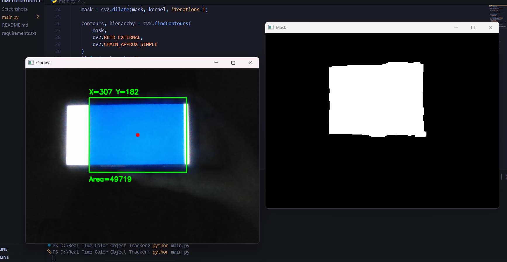
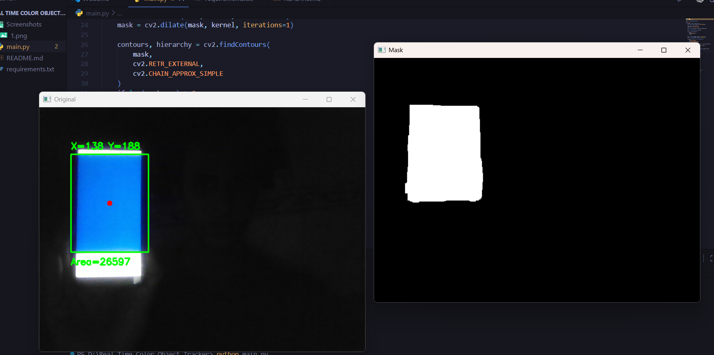

# Real-Time Color Object Tracker

It uses real time webcam to capture any blue color image or object, and calculates its area while showing the coordinating display of X,Y.

It converts BGR to HSV first for better space conversion and basic mask generation with contour detection to bound a rectangle around the object while detecting a center point.

It was basic project i did to understand more of the fundamentals of python and opencv.

